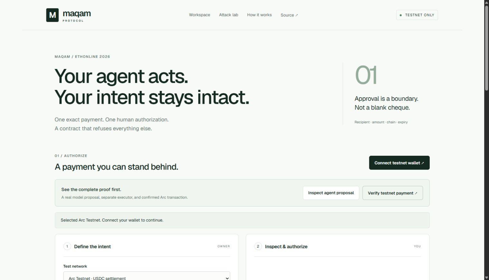

# Maqam Protocol

Exact, single-use authorization for agent payments. New ETHOnline 2026 application using the public Maqam library. [Build provenance and track correction](docs/BUILD-PROVENANCE.md).

An agent proposes a payment. A person reviews and signs its exact terms. A smart contract verifies the signature and executes that payment once. Changing the recipient, amount, chain, contract, executor, evidence commitment, or expiry invalidates the authorization. Replay and revoked authorizations fail.

Built during ETHOnline, beginning September 12, 2026. This is an unaudited testnet prototype.

**The Graph supplies live agent discovery and screening.** Search Agent0 ERC-8004 records on Base Sepolia, inspect REVIEW/HOLD decisions and a recorded real model analysis, then bind a selected agent's refreshed Graph snapshot to a payment authorization. Arc settles the exact approved USDC payment. [Integration, evidence and limits](docs/GRAPH-INTEGRATION.md).

## Try the working project

- **[Live app](https://ethonline.ajnasnb.com)** — choose “Verify testnet payment” to verify a real receipt against Arc without connecting a wallet.
- **[Actual USDC payment](https://testnet.arcscan.app/tx/0x29df2d8d76cc95eca476461b45de397d4ca0cc565640edf8d86f80b609d4826e)** — a separately funded executor settled the owner's exact signed authorization.
- **[Fully source-verified Arc contract](https://testnet.arcscan.app/address/0x8267D3D996e4884BBc7E88307a46A957AC95ea2b?tab=contract)** — Solidity 0.8.36, chain 5042002. [Verification evidence](public/evidence/source-verification.json).
- [Architecture and trust boundaries](docs/ARCHITECTURE.md), [human demo script](docs/DEMO-SCRIPT.md), [Arc feedback](FEEDBACK.md).



## Why this exists

An agent should not need a reusable wallet key to pay one approved invoice. Maqam turns a reviewed intent into a narrowly scoped capability: one owner, executor, token, recipient, amount, nonce, deadline, epoch, evidence commitment, chain and contract. The contract consumes the nonce atomically with the transfer. A changed destination or amount fails signature verification; a second execution fails even if the agent bypasses the application gateway.

The demonstration uses Arc's real test USDC ERC20 interface, with USDC also paying executor gas. The agent proposes; the owner controls authorization; the executor can only settle the signed terms. Owner nonce cancellation and epoch revocation remain available until execution.

## Run and verify

Requires Node.js 22.12+ and npm. No wallet or API key is needed for the tests or recorded receipt viewer.

```sh
npm ci
npm run compile
npm test
npm run dev
```

Open `http://127.0.0.1:5186`. `npm run build` creates the production frontend. Vercel serves `api/proposal.mjs`, a real Maqam policy endpoint; the Vite development server provides the same route.

The primary public app uses Cloudflare Workers and Static Assets at `ethonline.ajnasnb.com` (with `maqam.ajnasnb.com` as an alias). `worker.mjs` adapts the exact same policy handler and bounds streamed request bodies to 4 KB. Vercel remains a git-deployed mirror at https://maqam-protocol.vercel.app; its default hostname timed out from the development connection. To update the primary deployment, build and run `wrangler deploy` with an authenticated Wrangler 4 CLI. Review `wrangler.jsonc` before deploying from a different account. GitHub CI verifies the code; the Cloudflare deployment currently requires this explicit command.

The 22 tests cover EVM payment and event consistency, signed fields, executor and domain restrictions, expiry, cancellation, epoch revocation, rollback, ERC-1271, reentrancy, runtime-bytecode checks, network guards, Maqam policy, Worker adapters, Graph screening and snapshot integrity. Ganache may fall back to its JavaScript implementation on newer Node versions.

```sh
npm run proof        # fresh local chain, Maqam approval queue and adversarial proof
```

For an interactive wallet demo, connect a testnet wallet, select Arc Testnet, obtain test USDC from the [Circle faucet](https://faucet.circle.com), review a small payment to an address you control, approve the exact ERC20 allowance, and sign. The connected wallet defaults to the executor; signed packets can also be exported to a separate executor wallet. The app rejects mainnet transactions and verifies deployed executor bytecode before use. Never use real assets with this prototype.

## Recorded agent and chain evidence

`public/evidence/agent-proposal.json` preserves a real model request, output and Maqam decision for a synthetic invoice. `public/evidence/arc-proof.json` binds that output to the successful onchain payment. The hosted interface explicitly identifies this as a recorded model call. It does not claim to host a live model endpoint.

The owner and executor in this evidence are separate **scripted test accounts**. This proves the protocol path, not a completed human usability test. Rejection evidence uses `eth_call`; the successful transfer is a mined transaction. The browser independently verifies the event digest and consumed nonce against Arc RPC.

An optional fresh proposal uses `npm run agent` with `AGENT_API_URL`, `AGENT_MODEL` and `AGENT_API_KEY`. It sends only the synthetic invoice and has no owner signing key. Test-account generation and Arc deployment scripts save keys only under ignored `data/`; never publish that directory. `npm run proof:arc` requires locally funded dedicated test accounts and the recorded proposal. Historical deployments and proofs are retained rather than overwritten without provenance.

## Limits

The 25-token review threshold is application policy, not a global onchain spending cap. The signed amount is the contract's exact limit. Fee-on-transfer, rebasing and malicious tokens are unsupported. Evidence hashes are commitments, not encryption or proof an invoice is true. Production use needs an audit, durable application identity and queues, monitoring, recovery and confidentiality design. Ganache has upstream development-dependency advisories and is not part of the deployed function.

## Provenance

The earlier [Maqam](https://github.com/AjnasNB/maqam) TypeScript library implements application-side policy, exact approvals, and receipts. This project's new contribution is contract-enforced authorization, typed wallet signing, a payment interface, adversarial demonstrations, and independently inspectable chain receipts. We will identify every reused dependency and every completed integration; no prior project code is represented as new event work.

See [the implementation specification](docs/SPEC.md), [AI assistance disclosure](docs/AI-ASSISTANCE.md), and [human contribution checklist](docs/HUMAN-CONTRIBUTIONS.md). Human testing and a human-narrated demo remain required before a compliant final submission. No unimplemented sponsor integration is claimed.

For the final walkthrough, use the [hands-on test and real Chrome recording guide](docs/TEST-AND-RECORD.md) and [human narration script](docs/NARRATION.txt). The script distinguishes retained model/payment evidence from live chain verification.
