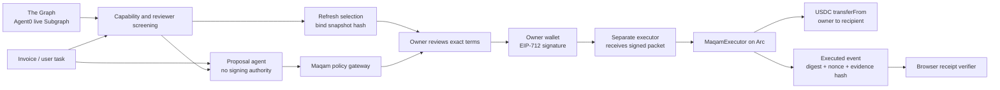

# Architecture and trust boundaries

## What changed during ETHOnline

Maqam 0.3.3 is an existing MIT TypeScript library. Its policy and exact-approval queue govern registered adapter calls inside the application. ETHOnline work adds an independent enforcement boundary on an EVM chain: bypassing Maqam cannot bypass the signed payment or used nonce.

The new contracts, EIP-712 client, wallet UX, policy endpoint, adversarial tests, proposal adapter, Arc deployment, receipt viewer, and evidence scripts were built in this repository during the event. The original Maqam library is installed as an explicitly pinned dependency rather than copied into the new repository.

## Hosted and local components

- `/api/agents` reads live Graph data, applies deterministic screening and rejects stale or unhealthy indexes. `graph-agent-propose.mjs` feeds that data to a real model for candidate review. A selected agent's Graph snapshot is refreshed during wallet review and bound into the evidence commitment. See `GRAPH-INTEGRATION.md` for scope and the distinction between the Graph demonstration and the separate mined Arc fixture.

- Vite builds the static browser interface. It requests wallet signatures and testnet transactions through an injected EIP-1193 wallet.
- `/api/proposal` runs the real Maqam library in a Vercel function and applies a 25-token per-payment review policy. This endpoint does not sign or transfer funds and does not receive invoice text.
- The primary `maqam.ajnasnb.com` deployment serves the same endpoint through Cloudflare Workers and serves the Vite build as Static Assets. The Worker bounds request bodies to 4 KB and calls the shared Vercel-compatible handler directly. Vercel remains a deployment mirror.
- The Solidity contract validates owner, executor, token, recipient, amount, nonce, expiry, epoch and evidence commitment. The EIP-712 domain binds chain and verifier.
- The contract uses OpenZeppelin SafeERC20, SignatureChecker (including ERC-1271), EIP712 and ReentrancyGuard. It contains no administrator, upgrade proxy or fund-withdrawal authority.
- An optional local model adapter accepts an OpenAI-compatible endpoint and credentials. The retained demonstration used a real Azure OpenAI GPT-5.6 Sol call on a synthetic invoice. The hosted UI exposes the recorded proposal and its complete prompt/output, rather than pretending it is a live AI service.
- The scripted Arc proof uses separate local test accounts for owner and executor. Owner signing is automated in the fixture; it does not constitute a human UX test. The agent is supplied only the signed packet and its own executor key.

## Arc integration

Chain ID: 5042002. Contract: `0x8267D3D996e4884BBc7E88307a46A957AC95ea2b`, compiled with Solidity 0.8.36. Earlier deployment and payment evidence is retained in `public/deployments-history.json` and `public/evidence/`.

USDC: `0x3600000000000000000000000000000000000000`. Arc's native and ERC20 USDC interfaces share one balance. Native gas amounts use 18 decimals; the ERC20 payment interface uses 6. The application does not double-count the two interfaces as separate assets.

Arc is necessary to the demonstrated workflow: it settles the actual conditional stablecoin payment, pays executor gas in USDC and preserves the independently verifiable authorization receipt. See [network documentation](https://docs.arc.io/arc/references/connect-to-arc) and [token documentation](https://docs.arc.io/arc/references/contract-addresses).

## Precise limitations

This is an unaudited testnet prototype. The 25-token policy is an application-side review rule, not a contract-wide spending cap. The owner's signed amount is the contract's exact limit. The UI only allows selected test networks, but the Solidity primitive itself is chain-agnostic.

The payment token must behave like a normal ERC20. Fee-on-transfer, rebasing and malicious tokens are not supported. An evidence hash is a commitment, not encryption and not evidence of invoice truth. Low-entropy private text can be guessed from a public hash; use a salted evidence scheme before handling confidential real invoices.

Maqam's approval queue in the scripts is in-process. Durable application identity, rate limits for a public model endpoint, distributed queues, custody policy, security audit, monitoring, and recovery procedures remain production work. Ganache is a local development dependency with upstream npm advisories; it is not imported by the hosted runtime.
